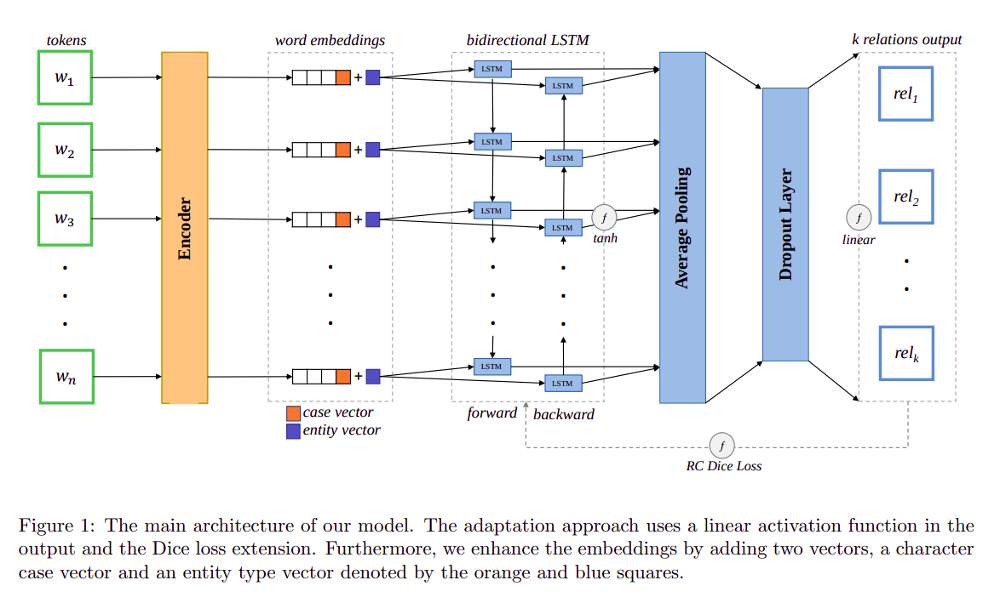

# Multiple Relations Classification using Imbalanced Predictions Adaptation

## Abstract 
The relation classification task assigns the proper semantic relation to a pair of subject and object entities; the task plays a crucial role in various text mining applications, such as knowledge graph construction and entities interaction discovery in biomedical text. Current relation classification models employ additional procedures to identify multiple relations in a single sentence. Furthermore, they overlook the imbalanced predictions pattern. The pattern arises from the presence of a few valid relations that need positive labeling in a relatively large predefined relations set. We propose a multiple relations classification model that tackles these issues through a customized output architecture and by exploiting additional input features. Our findings suggest that handling the imbalanced predictions leads to significant improvements, even on a modest training design. The results demonstrate superiority performance on benchmark datasets commonly used in relation classification. To the best of our knowledge, this work is the first that recognizes the imbalanced predictions within the relation classification task.



## Requirements
- Python 3.9
- TensorFlow 2.11
- TQDM 4

**Install Requirements**
```
python3 -m pip install tensorflow==2.11.*
python3 -m pip install tqdm
```

## Pre-trained Language Model
* RCEP achieves its best performance using **Glove word representation** (6B tokens, 400K vocab, uncased, 300d vectors)

[Download Glove](https://nlp.stanford.edu/projects/glove/)

## Datasets
Pre-processed data is available in `data` folder. Raw datasets can be downloaded using the links below:
- [NYT](https://github.com/xiangrongzeng/copy_re)
- [WEBNLG](https://github.com/yubowen-ph/JointER/tree/master/dataset/WebNLG/data)

## Run Training
* The below train/test scripts uses the reported hyperparameters in the paper.
* Please review `run.sh` to check the default arguments.

**WEBNLG**
```
./run.sh train webnlg_checkpoint data/webnlg > output.out &
```
**NYT**
```
./run.sh train nyt_checkpoint data/nyt > output.out &
```

## Run Tests
* To use the provided checkpoints with the reported arguments in the paper.

**WEBNLG**
```
./run.sh test webnlg_checkpoint data/webnlg > output.out &
```
**NYT**
```
./run.sh test nyt_checkpoint data/nyt > output.out &
```

## Links

- [Full paper on Arxiv](https://arxiv.org/abs/2309.13718)
